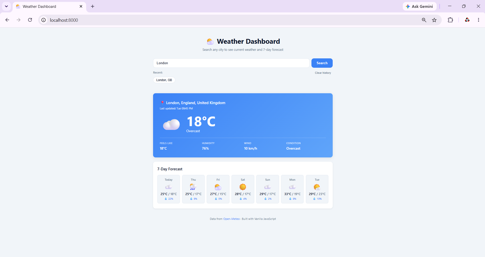

# Weather Dashboard

> A simple, responsive weather app built with Vanilla JavaScript.
> Search any city worldwide and view current conditions and a 7-day forecast.

[](https://developer.mozilla.org/en-US/docs/Web/JavaScript)
[](https://developer.mozilla.org/en-US/docs/Web/HTML)
[](https://developer.mozilla.org/en-US/docs/Web/CSS)


## Screenshots



## Features

- Search any city worldwide
- Current weather: temperature, conditions, wind, humidity, feels-like
- 7-day forecast with max/min temperatures and precipitation
- Recent searches saved in localStorage (last 5 cities)
- Fully responsive — works on mobile, tablet, desktop
- No build step, no API key — just open `index.html`

## Tech Stack

- **Frontend**: Vanilla JavaScript (ES6+), HTML5, CSS3
- **API**: [Open-Meteo](https://open-meteo.com) (free, no API key required)
- **Storage**: Browser localStorage

## Quick Start

### Option 1: Open directly
```bash
git clone https://github.com/Hoale66P1/weather-dashboard.git
cd weather-dashboard
```

### Option 2: Local server (recommended for dev — ES modules require http://)
```bash
python -m http.server 8000
```

## Project Structure

```
weather-dashboard/
├── index.html
├── css/style.css
└── js/
    ├── app.js         # Entry point, event handlers
    ├── api.js         # Open-Meteo API calls
    ├── ui.js          # DOM rendering
    └── storage.js     # localStorage helpers
```

## 🌐 API Reference

This app uses two Open-Meteo endpoints:
- **Geocoding**: `geocoding-api.open-meteo.com/v1/search`
- **Forecast**: `api.open-meteo.com/v1/forecast`

No API key required.

## Deploy to GitHub Pages

1. Push to GitHub
2. Go to repo Settings → Pages
3. Source: branch `main`, folder `/ (root)`
4. Save → wait ~1 minute → app live at `https://{username}.github.io/weather-dashboard/`
